# Organizational Chart

## Company Structure

```mermaid
graph TD
    %% Executive
    Pres[PRESIDENT] --> Sales[SALES DEPARTMENT]
    Pres --> WH[WAREHOUSE & LOGISTICS<br>Vincent Bayaua - Warehouse Manager]

    %% Sales Department
    Sales --> S_Lights[LIGHTS<br>M. Medina - Area Sales Mngr]
    Sales --> S_Furn[FURNITURE<br>Dom Monterozo - Sales Mngr]
    Sales --> S_Area[AREA SALES<br>Jay Quindao - Area Sales Mngr]
    Sales --> S_LRI[LRI SALES<br>JM Mercene - LRI Sales Mngr]
    Sales --> S_Lev[LEVANTO SALES<br>Carlota Ramos - Sales Mngr]

    %% Sales Sub-nodes
    S_Lights --> SL_Neo[Neovega]
    S_Lights --> SL_Amb[Ambient]
    S_Lights --> SL_Mil[Milana]
    
    S_Furn --> SF_Mon[Montini]
    S_Furn --> SF_Mar[Marrina]
    S_Furn --> SF_Bon[Bonbonnaire]
    S_Furn --> SF_Maz[Mazzina/Forma Rossa]
    
    S_Area --> SA_Mis[Miscella LRI/MC BGC]
    S_Area --> SA_Daa[Daaz Alabang/MC BGC]
    S_Area --> SA_Mar[Marque]
    
    S_LRI --> SLR_Neo[Neovega]
    S_LRI --> SLR_Amb[Ambient]
    S_LRI --> SLR_Mil[Milana]
    S_LRI --> SLR_Smart[Smarthome]
    
    S_Lev --> SV_Mon[Monarq]
    S_Lev --> SV_Sis[Sistema]
    S_Lev --> SV_Ven[Venetian]

    %% Warehouse Department
    WH --> WH_Furn[FURNITURE WAREHOUSE<br>Rommel Vejano - Warehouse Officer]
    WH --> WH_Del[DELIVERY & INSTALLATION]
    WH --> WH_Light[LIGHTS WAREHOUSE<br>Edmar Palines - Asst. Warehouse Mngr]

    %% Furniture Warehouse Sub-nodes
    WH_Furn --> WHF_Pick[Pickers]
    WH_Furn --> WHF_Fab[Fabricators: Rubin Taylaran]
    WH_Furn --> WHF_Ware[Warehousemen]
    
    %% Delivery & Installation Sub-nodes
    WH_Del --> WHD_T1[Jeff]
    WH_Del --> WHD_T2[Jonathan]
    WH_Del --> WHD_T3[Umali]
    WH_Del --> WHD_T4[Furniture Team]
    WH_Del --> WHD_I1[Empleo - Roving Installer]
    WH_Del --> WHD_I2[Flaviano - Roving Installer]
    WH_Del --> WHD_I3[Quellar - Roving Installer]
    
    %% Lights Warehouse Sub-nodes
    WH_Light --> WHL_VA[Vincent Rivero - Warehouse Asst]
    WH_Light --> WHL_RD[Ryan dela Cruz - Warehouse Asst]
    WH_Light --> WHL_PA[Paul Ablay - Inventory]
    WH_Light --> WHL_RM[Randy Minoza - Electrician]
    WH_Light --> WHL_KA[Ken Abila - Electrician]
    WH_Light --> WHL_Paint[Painters]
    WH_Light --> WHL_LM[Mack Ramirez - Location Assistant LRI]
    WH_Light --> WHL_LA[Andy E. - Location Assistant Robins]
    WH_Light --> WHL_OO[Orly Orlanda - Warehouse Asst Logistics]
```

## Department Overview

### Sales Department
Manages 5 key sales divisions:
- **Lights** (M. Medina) - Brands: Neovega, Ambient, Milana
- **Furniture** (Dom Monterozo) - Brands: Montini, Marrina, Bonbonnaire, Mazzina/Forma Rossa
- **Area Sales** (Jay Quindao) - Locations: Miscella LRI/MC BGC, Daaz Alabang/MC BGC, Marque
- **LRI Sales** (JM Mercene) - Brands: Neovega, Ambient, Milana, Smarthome
- **Levanto Sales** (Carlota Ramos) - Brands: Monarq, Sistema, Venetian

### Warehouse & Logistics Department
Managed by Vincent Bayaua, includes 3 sections:

#### Furniture Warehouse (Rommel Vejano - Warehouse Officer)
- Pickers
- Fabricators: Rubin Taylaran
- Warehousemen

#### Delivery & Installation
- **Delivery Teams:** Jeff, Jonathan, Umali, Furniture Team
- **Roving Installers:** Empleo, Flaviano, Quellar

#### Lights Warehouse (Edmar Palines - Asst. Warehouse Mngr)
- **Warehouse Assistants:** Vincent Rivero, Ryan dela Cruz
- **Inventory:** Paul Ablay
- **Electricians:** Randy Minoza, Ken Abila
- **Painters**
- **Location Assistants:** Mack Ramirez (LRI), Andy E. (Robins)
- **Logistics:** Orly Orlanda - Warehouse Asst Logistics
